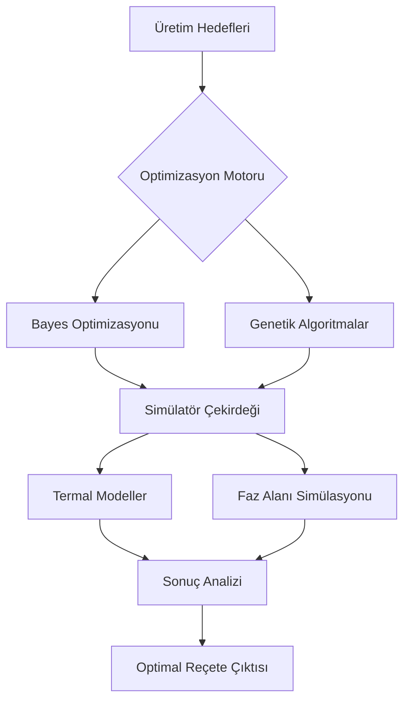

# MicroGrav-Materials-Optimizer (Mikro-Yerçekimi Malzeme Optimizatörü)

[](https://opensource.org/licenses/MIT)
[](https://tua.gov.tr)
[](https://scipy.org)

## 🌌 Genel Bakış
**MicroGrav-Materials-Optimizer**, mikro-yerçekimi ortamlarında (ISS veya gelecekteki ticari uzay istasyonları gibi) malzeme üretim süreçlerini optimize etmek için tasarlanmış gelişmiş bir hesaplama çerçevesidir. **TUA Astro Hackathon 2026** için geliştirilen bu araç, Dünya yerçekimi etkisi dışındaki yüksek performanslı alaşımlar ve kristaller için ideal işleme parametrelerini belirlemek amacıyla Bayes optimizasyonu ve fiziksel simülasyon kullanır.

### 🔬 Mikro-Yerçekimi Avantajı
Uzayda üretim; yerçekimi kaynaklı kaldırma kuvveti (buoyancy), konveksiyon ve çökelmeyi ortadan kaldırır. Bu şunları sağlar:
- **Homojen Katılaşma:** Konveksiyonun bastırılması, süper alaşımlarda tek tip dendrit büyümesine yol açar.
- **Gelişmiş Kristal Saflığı:** Kaldırma kuvveti kaynaklı akışların kaldırılması, mükemmel yarı iletken ve farmasötik kristaller oluşturur.
- **Konteynırsız İşleme:** Yüzey gerilimi odaklı ortamlar, pota duvarlarından kaynaklanan kirlenmeyi önler.

---

## 🚀 Temel Özellikler

### 1. Bayes Süreç Optimizatörü
Nikel bazlı süper alaşımlarda dendrit kol aralığını (DAS) ve kusurları en aza indirmek için Gauss Süreci Regresörlerini kullanır.
- **Parametreler:** Soğutma hızı, sıcaklık gradyanı, gaz basıncı.
- **Hedef:** Maksimum yapısal bütünlük ve termal direnç.

### 2. Mikro-Katılaşma Simülatörü
Sıfır-G ortamlarında sıvıdan katı faza geçişi simüle eden yüksek sadakatli bir sayısal model.
- **Difüzif Taşıma Modeli:** Konveksiyon akımları olmadan ısı transferini modeller.
- **Dendrit Oluşumu:** İkincil kol büyüme modellerini görselleştirir.

### 3. Uzay Üretimi ROI Analitiği
Uzayda üretilen malzemelerin (örneğin ZBLAN optik fiberler) karasal üretime kıyasla ekonomik uygulanabilirliğini hesaplayan stratejik modül.

---

## 🏗 Sistem Mimarisi



---

## 🛠 Kurulum

```bash
# Depoyu klonlayın
git clone https://github.com/yunus/MicroGrav-Materials-Optimizer.git

# Bağımlılıkları yükleyin
pip install -r requirements.txt
```

## 📖 Kullanım Örnekleri

### Optimizasyon Döngüsünü Çalıştırma
```python
from src.optimizers.bayesian import ProcessOptimizer

optimizer = ProcessOptimizer(material="Inconel-718")
best_params = optimizer.run(trials=50)
print(f"Optimal Soğutma Hızı: {best_params['cooling_rate']} K/s")
```

---

## 📄 Belgeler
- [Matematiksel Temeller](docs/technical_spec.md)
- [Malzeme Kütüphanesi](data/materials.json)

---

## 🤝 Katkıda Bulunma
Katkılarınızı bekliyoruz! Daha fazla bilgi için lütfen Katkı Yönergesine bakın.

## ⚖ Lisans
Bu proje MIT Lisansı ile lisanslanmıştır - ayrıntılar için [LICENSE](LICENSE) dosyasına bakın.

---
**TUA Astro Hackathon 2026 için ❤️ ile geliştirilmiştir**
